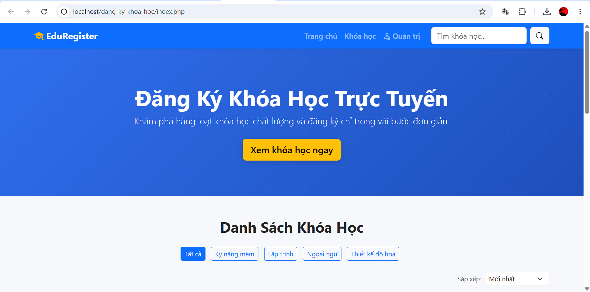
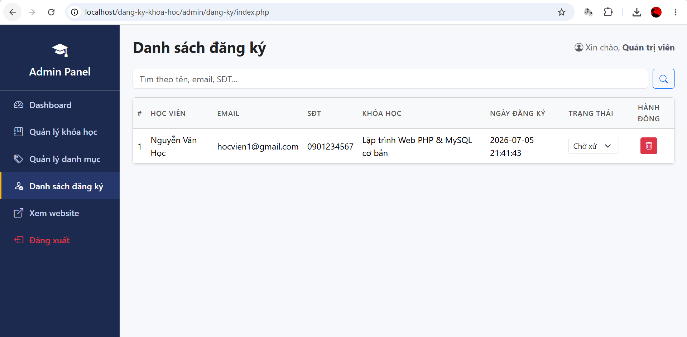
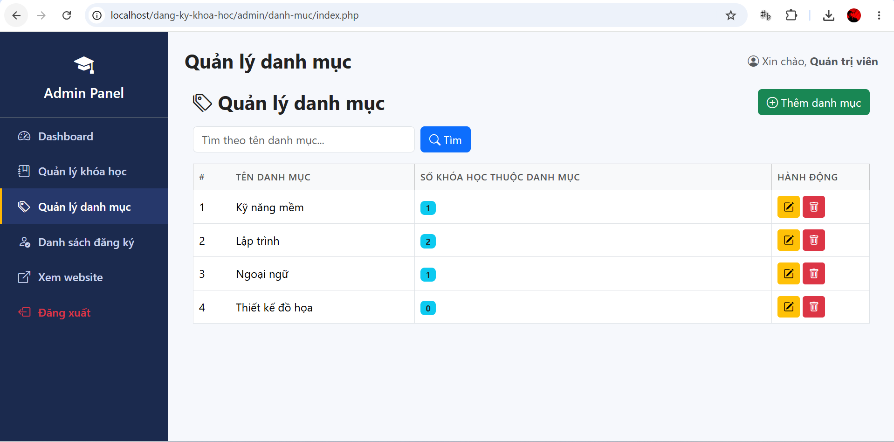
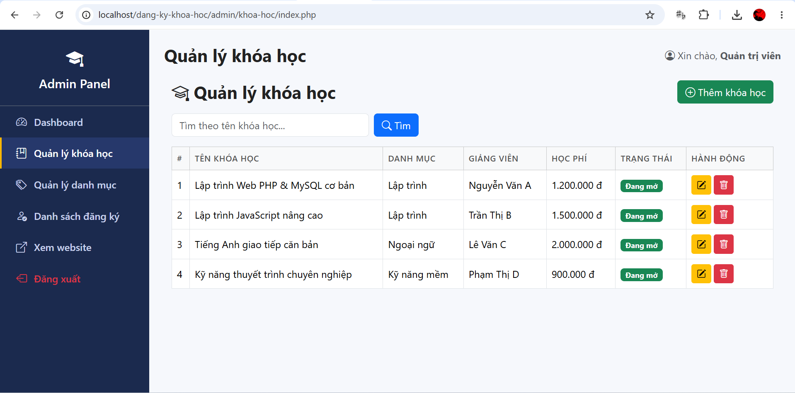
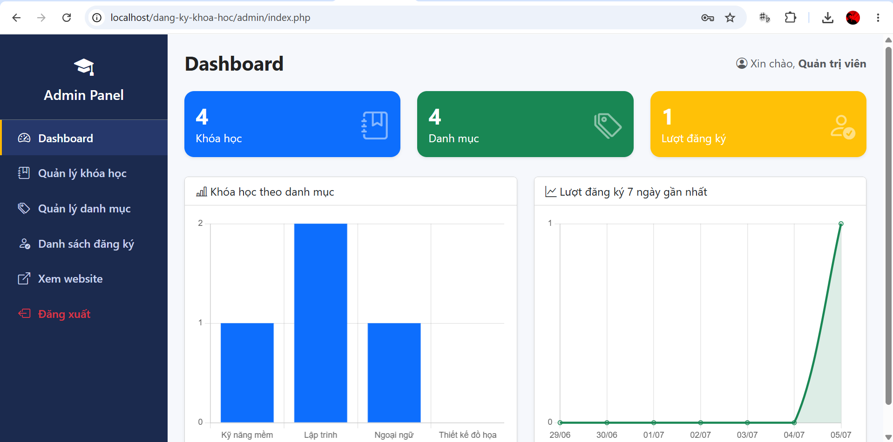
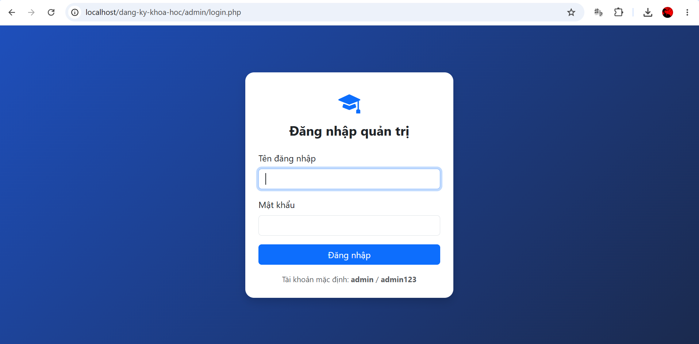

# Website Đăng Ký Khóa Học

Đồ án cuối kỳ - Học phần: **Lập trình Web**
Nhóm đề tài: **Nhóm dịch vụ – Đăng ký khóa học**

## 1. Tên đề tài
Xây dựng website cho phép người dùng xem danh sách khóa học và đăng ký học trực tuyến;
quản trị viên quản lý khóa học, danh mục và danh sách học viên đăng ký.

## 2. Danh sách thành viên

| STT | Họ và tên | MSSV | Vai trò |
|-----|-----------|------|---------|
| 1   | Trịnh Lâm Huy | 24210501016 | Nhóm trưởng |
| 2   | Mã Khánh Tường | 24210501041 | Thành viên |
| 3   | Lê Nhựt Duy | 24210501006 | Thành viên |
| 4   | Nguyễn Ca Gu | 24210501053 | Thành viên |

## 3. Phân công công việc

| STT | Họ tên | MSSV | Công việc đảm nhận | Tỷ lệ đóng góp |
|-----|--------|------|---------------------|-----------------|
| 1   | Trịnh Lâm Huy | 24210501016 | Thiết kế CSDL, cấu hình kết nối, trang chủ, trang chi tiết, xử lý đăng ký, quản lý repo/review PR, quay video demo & làm PPT trình bày | 31% |
| 2   | Mã Khánh Tường  | 24210501041 | Trang quản trị: Quản lý khóa học + Quản lý danh mục (CRUD đầy đủ) | 23% |
| 3   | Lê Nhựt Duy | 24210501006 | Đăng nhập/đăng xuất, Dashboard thống kê, giao diện khung admin | 23% |
| 4   | Nguyễn Ca Gu | 24210501053 | Quản lý danh sách đăng ký, giao diện CSS/JS, viết README | 23% |

## 4. Công nghệ sử dụng

- HTML5, CSS3, Bootstrap 5
- JavaScript (thuần)
- PHP (thuần, không dùng framework)
- MySQL + PDO
- Git & GitHub

## 5. Mô tả chức năng

### Người dùng (Frontend)
- Trang chủ: hiển thị danh sách khóa học dạng Card, banner, tìm kiếm theo tên khóa học.
- Trang chi tiết khóa học: xem thông tin đầy đủ + form đăng ký khóa học.
- Xử lý đăng ký: kiểm tra dữ liệu đầu vào, lưu vào CSDL, thông báo kết quả.

### Quản trị (Admin)
- Đăng nhập / Đăng xuất (mật khẩu được hash bằng `password_hash()`).
- Quản lý khóa học: Thêm / Sửa / Xóa / Tìm kiếm.
- Quản lý danh mục: Thêm / Sửa / Xóa.
- Quản lý danh sách đăng ký: Xem / Tìm kiếm / Cập nhật trạng thái / Xóa.
- Dashboard thống kê tổng quan số lượng khóa học, danh mục, lượt đăng ký.

> Các chức năng điểm khuyến khích (phân trang, lọc, upload ảnh, biểu đồ, xuất Excel/PDF, dark mode...)

## 6. Cấu trúc thư mục

dang-ky-khoa-hoc/
├── admin/                  # Trang quản trị
│   ├── includes/           # Header/Footer/Auth dùng chung cho admin
│   ├── khoa-hoc/           # CRUD khóa học
│   ├── danh-muc/           # CRUD danh mục
│   ├── dang-ky/            # Quản lý danh sách đăng ký
│   ├── login.php
│   ├── logout.php
│   └── index.php           # Dashboard
├── assets/
│   ├── css/style.css
│   ├── js/script.js
│   └── img/                # Hình ảnh khóa học
├── config/
│   └── database.php        # Kết nối PDO
├── database/
│   └── schema.sql          # File SQL tạo CSDL + dữ liệu mẫu
├── includes/
│   ├── header.php          # Header + navbar cho trang người dùng
│   └── footer.php
├── uploads/                 # Nơi lưu ảnh upload (chức năng mở rộng)
├── index.php                # Trang chủ
├── khoa-hoc-chi-tiet.php    # Trang chi tiết khóa học
├── dang-ky-xu-ly.php        # Xử lý đăng ký khóa học
├── dang-ky-thanh-cong.php   # Trang thông báo đăng ký thành công
└── README.md

## 7. Hướng dẫn cài đặt

1. Cài **XAMPP** (hoặc Laragon) để có sẵn Apache + PHP + MySQL.
2. Clone repository về thư mục `htdocs` (XAMPP) hoặc `www` (Laragon):
   bash
   git clone <https://github.com/trinhlamhuy2304/Nhom7-CuoiKy> dang-ky-khoa-hoc
   
3. Mở **phpMyAdmin**, tạo cơ sở dữ liệu bằng cách import file `database/schema.sql`
   (file này đã tự tạo database `dangkykhoahoc` và dữ liệu mẫu).
4. Mở file `config/database.php`, kiểm tra/chỉnh lại thông tin kết nối cho đúng máy bạn:
   php
   define('DB_HOST', 'localhost');
   define('DB_NAME', 'dangkykhoahoc');
   define('DB_USER', 'root');
   define('DB_PASS', '');
   define('BASE_URL', '/dang-ky-khoa-hoc'); // đổi theo tên thư mục project của bạn

## 8. Hướng dẫn chạy chương trình

1. Khởi động Apache và MySQL trong XAMPP Control Panel.
2. Truy cập trang người dùng: `http://localhost/dang-ky-khoa-hoc/index.php`
3. Truy cập trang quản trị: `http://localhost/dang-ky-khoa-hoc/admin/login.php`
   - Tài khoản mặc định: `admin`
   - Mật khẩu mặc định: `admin123`

## 9. Quy trình làm việc nhóm với Git/GitHub

- Repository: Public.
- Mỗi thành viên **tạo branch riêng** theo tên công việc, ví dụ: `feature/quan-ly-khoa-hoc`.
- **Không push trực tiếp lên nhánh `main`.**
- Sau khi hoàn thành, tạo **Pull Request** để merge vào `main`, nhóm trưởng review và duyệt.
- Commit thường xuyên, message rõ ràng, ví dụ:

  git add .
  git commit -m "feat: thêm chức năng CRUD quản lý khóa học"
  git push origin feature/quan-ly-khoa-hoc

## 10. Hình ảnh giao diện

## 11. Link video demo

